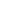

# Material icons

[All icon packs](../README.md)

Copy a qualified name into `icon = "material:name"`. Generated from `icons/material.luau`.

| Preview | Icon name |
|---|---|
|  | `material:ac_unit` |
|  | `material:access_alarm` |
|  | `material:access_alarms` |
|  | `material:access_time` |
|  | `material:accessibility` |
|  | `material:accessibility_new` |
|  | `material:accessible` |
|  | `material:accessible_forward` |
|  | `material:account_balance` |
|  | `material:account_balance_wallet` |
|  | `material:account_box` |
|  | `material:account_circle` |
|  | `material:account_tree` |
|  | `material:adb` |
|  | `material:add` |
|  | `material:add_a_photo` |
|  | `material:add_alarm` |
|  | `material:add_alert` |
|  | `material:add_box` |
|  | `material:add_circle` |
|  | `material:add_circle_outline` |
|  | `material:add_comment` |
|  | `material:add_location` |
|  | `material:add_photo_alternate` |
|  | `material:add_shopping_cart` |
|  | `material:add_to_home_screen` |
|  | `material:add_to_photos` |
|  | `material:add_to_queue` |
|  | `material:adjust` |
|  | `material:airline_seat_flat` |
|  | `material:airline_seat_flat_angled` |
|  | `material:airline_seat_individual_suite` |
|  | `material:airline_seat_legroom_extra` |
|  | `material:airline_seat_legroom_normal` |
|  | `material:airline_seat_legroom_reduced` |
|  | `material:airline_seat_recline_extra` |
|  | `material:airline_seat_recline_normal` |
|  | `material:airplanemode_active` |
|  | `material:airplanemode_inactive` |
|  | `material:airplay` |
|  | `material:airport_shuttle` |
|  | `material:alarm` |
|  | `material:alarm_add` |
|  | `material:alarm_off` |
|  | `material:alarm_on` |
|  | `material:album` |
|  | `material:all_inbox` |
|  | `material:all_inclusive` |
|  | `material:all_out` |
|  | `material:alternate_email` |
|  | `material:amp_stories` |
|  | `material:android` |
|  | `material:announcement` |
|  | `material:apartment` |
|  | `material:apps` |
|  | `material:archive` |
|  | `material:arrow_back` |
|  | `material:arrow_back_ios` |
|  | `material:arrow_downward` |
|  | `material:arrow_drop_down` |
|  | `material:arrow_drop_down_circle` |
|  | `material:arrow_drop_up` |
|  | `material:arrow_forward` |
|  | `material:arrow_forward_ios` |
|  | `material:arrow_left` |
|  | `material:arrow_right` |
|  | `material:arrow_right_alt` |
|  | `material:arrow_upward` |
|  | `material:art_track` |
|  | `material:aspect_ratio` |
|  | `material:assessment` |
|  | `material:assignment` |
|  | `material:assignment_ind` |
|  | `material:assignment_late` |
|  | `material:assignment_return` |
|  | `material:assignment_returned` |
|  | `material:assignment_turned_in` |
|  | `material:assistant` |
|  | `material:assistant_photo` |
|  | `material:atm` |
|  | `material:attach_file` |
|  | `material:attach_money` |
|  | `material:attachment` |
|  | `material:audiotrack` |
|  | `material:autorenew` |
|  | `material:av_timer` |
|  | `material:backspace` |
|  | `material:backup` |
|  | `material:ballot` |
|  | `material:bar_chart` |
|  | `material:barcode` |
|  | `material:bathtub` |
|  | `material:battery_20` |
|  | `material:battery_30` |
|  | `material:battery_50` |
|  | `material:battery_60` |
|  | `material:battery_80` |
|  | `material:battery_90` |
|  | `material:battery_alert` |
|  | `material:battery_charging_20` |
|  | `material:battery_charging_30` |
|  | `material:battery_charging_50` |
|  | `material:battery_charging_60` |
|  | `material:battery_charging_80` |
|  | `material:battery_charging_90` |
|  | `material:battery_charging_full` |
|  | `material:battery_full` |
|  | `material:battery_std` |
|  | `material:battery_unknown` |
|  | `material:beach_access` |
|  | `material:beenhere` |
|  | `material:block` |
|  | `material:bluetooth` |
|  | `material:bluetooth_audio` |
|  | `material:bluetooth_connected` |
|  | `material:bluetooth_disabled` |
|  | `material:bluetooth_searching` |
|  | `material:blur_circular` |
|  | `material:blur_linear` |
|  | `material:blur_off` |
|  | `material:blur_on` |
|  | `material:book` |
|  | `material:bookmark` |
|  | `material:bookmark_border` |
|  | `material:bookmarks` |
|  | `material:border_all` |
|  | `material:border_bottom` |
|  | `material:border_clear` |
|  | `material:border_color` |
|  | `material:border_horizontal` |
|  | `material:border_inner` |
|  | `material:border_left` |
|  | `material:border_outer` |
|  | `material:border_right` |
|  | `material:border_style` |
|  | `material:border_top` |
|  | `material:border_vertical` |
|  | `material:branding_watermark` |
|  | `material:brightness_1` |
|  | `material:brightness_2` |
|  | `material:brightness_3` |
|  | `material:brightness_4` |
|  | `material:brightness_5` |
|  | `material:brightness_6` |
|  | `material:brightness_7` |
|  | `material:brightness_auto` |
|  | `material:brightness_high` |
|  | `material:brightness_low` |
|  | `material:brightness_medium` |
|  | `material:broken_image` |
|  | `material:brush` |
|  | `material:bubble_chart` |
|  | `material:bug_report` |
|  | `material:build` |
|  | `material:burst_mode` |
|  | `material:business` |
|  | `material:business_center` |
|  | `material:cached` |
|  | `material:cake` |
|  | `material:calendar_today` |
|  | `material:calendar_view_day` |
|  | `material:call` |
|  | `material:call_end` |
|  | `material:call_made` |
|  | `material:call_merge` |
|  | `material:call_missed` |
|  | `material:call_missed_outgoing` |
|  | `material:call_received` |
|  | `material:call_split` |
|  | `material:call_to_action` |
|  | `material:camera` |
|  | `material:camera_alt` |
|  | `material:camera_enhance` |
|  | `material:camera_front` |
|  | `material:camera_rear` |
|  | `material:camera_roll` |
|  | `material:cancel` |
|  | `material:cancel_presentation` |
|  | `material:cancel_schedule_send` |
|  | `material:card_giftcard` |
|  | `material:card_membership` |
|  | `material:card_travel` |
|  | `material:casino` |
|  | `material:cast` |
|  | `material:cast_connected` |
|  | `material:cast_for_education` |
|  | `material:category` |
|  | `material:cell_wifi` |
|  | `material:center_focus_strong` |
|  | `material:center_focus_weak` |
|  | `material:change_history` |
|  | `material:chat` |
|  | `material:chat_bubble` |
|  | `material:chat_bubble_outline` |
|  | `material:check` |
|  | `material:check_box` |
|  | `material:check_box_outline_blank` |
|  | `material:check_circle` |
|  | `material:check_circle_outline` |
|  | `material:chevron_left` |
|  | `material:chevron_right` |
|  | `material:child_care` |
|  | `material:child_friendly` |
|  | `material:chrome_reader_mode` |
|  | `material:class` |
|  | `material:clear` |
|  | `material:clear_all` |
|  | `material:close` |
|  | `material:closed_caption` |
|  | `material:cloud` |
|  | `material:cloud_circle` |
|  | `material:cloud_done` |
|  | `material:cloud_download` |
|  | `material:cloud_off` |
|  | `material:cloud_queue` |
|  | `material:cloud_upload` |
|  | `material:code` |
|  | `material:collections` |
|  | `material:collections_bookmark` |
|  | `material:color_lens` |
|  | `material:colorize` |
|  | `material:comment` |
|  | `material:commute` |
|  | `material:compare` |
|  | `material:compare_arrows` |
|  | `material:compass_calibration` |
|  | `material:computer` |
|  | `material:confirmation_number` |
|  | `material:contact_mail` |
|  | `material:contact_phone` |
|  | `material:contact_support` |
|  | `material:contactless` |
|  | `material:contacts` |
|  | `material:content_copy` |
|  | `material:content_cut` |
|  | `material:content_paste` |
|  | `material:control_camera` |
|  | `material:control_point` |
|  | `material:control_point_duplicate` |
|  | `material:copyright` |
|  | `material:create` |
|  | `material:create_new_folder` |
|  | `material:credit_card` |
|  | `material:crop` |
|  | `material:crop_16_9` |
|  | `material:crop_3_2` |
|  | `material:crop_5_4` |
|  | `material:crop_7_5` |
|  | `material:crop_din` |
|  | `material:crop_free` |
|  | `material:crop_landscape` |
|  | `material:crop_original` |
|  | `material:crop_portrait` |
|  | `material:crop_rotate` |
|  | `material:crop_square` |
|  | `material:dashboard` |
|  | `material:data_usage` |
|  | `material:date_range` |
|  | `material:deck` |
|  | `material:dehaze` |
|  | `material:delete` |
|  | `material:delete_forever` |
|  | `material:delete_outline` |
|  | `material:delete_sweep` |
|  | `material:departure_board` |
|  | `material:description` |
|  | `material:desktop_access_disabled` |
|  | `material:desktop_mac` |
|  | `material:desktop_windows` |
|  | `material:details` |
|  | `material:developer_board` |
|  | `material:developer_mode` |
|  | `material:device_hub` |
|  | `material:device_unknown` |
|  | `material:devices` |
|  | `material:devices_other` |
|  | `material:dialer_sip` |
|  | `material:dialpad` |
|  | `material:directions` |
|  | `material:directions_bike` |
|  | `material:directions_boat` |
|  | `material:directions_bus` |
|  | `material:directions_car` |
|  | `material:directions_railway` |
|  | `material:directions_run` |
|  | `material:directions_subway` |
|  | `material:directions_transit` |
|  | `material:directions_walk` |
|  | `material:disc_full` |
|  | `material:divide` |
|  | `material:dns` |
|  | `material:do_not_disturb` |
|  | `material:do_not_disturb_alt` |
|  | `material:do_not_disturb_off` |
|  | `material:dock` |
|  | `material:domain` |
|  | `material:domain_disabled` |
|  | `material:done` |
|  | `material:done_all` |
|  | `material:done_outline` |
|  | `material:donut_large` |
|  | `material:donut_small` |
|  | `material:double_arrow` |
|  | `material:drafts` |
|  | `material:drag_handle` |
|  | `material:drag_indicator` |
|  | `material:drive_eta` |
|  | `material:duo` |
|  | `material:dvr` |
|  | `material:dynamic_feed` |
|  | `material:eco` |
|  | `material:edit` |
|  | `material:edit_attributes` |
|  | `material:edit_location` |
|  | `material:eject` |
|  | `material:email` |
|  | `material:emoji_emotions` |
|  | `material:emoji_events` |
|  | `material:emoji_flags` |
|  | `material:emoji_food_beverage` |
|  | `material:emoji_nature` |
|  | `material:emoji_objects` |
|  | `material:emoji_people` |
|  | `material:emoji_symbols` |
|  | `material:emoji_transportation` |
|  | `material:enhanced_encryption` |
|  | `material:equalizer` |
|  | `material:equals` |
|  | `material:error` |
|  | `material:error_outline` |
|  | `material:euro` |
|  | `material:euro_symbol` |
|  | `material:ev_station` |
|  | `material:event` |
|  | `material:event_available` |
|  | `material:event_busy` |
|  | `material:event_note` |
|  | `material:event_seat` |
|  | `material:exit_to_app` |
|  | `material:expand_less` |
|  | `material:expand_more` |
|  | `material:explicit` |
|  | `material:explore` |
|  | `material:explore_off` |
|  | `material:exposure` |
|  | `material:exposure_neg_1` |
|  | `material:exposure_neg_2` |
|  | `material:exposure_plus_1` |
|  | `material:exposure_plus_2` |
|  | `material:exposure_zero` |
|  | `material:extension` |
|  | `material:face` |
|  | `material:fast_forward` |
|  | `material:fast_rewind` |
|  | `material:fastfood` |
|  | `material:favorite` |
|  | `material:favorite_border` |
|  | `material:featured_play_list` |
|  | `material:featured_video` |
|  | `material:feedback` |
|  | `material:fiber_dvr` |
|  | `material:fiber_manual_record` |
|  | `material:fiber_new` |
|  | `material:fiber_pin` |
|  | `material:fiber_smart_record` |
|  | `material:file_copy` |
|  | `material:file_upload` |
|  | `material:filter` |
|  | `material:filter_1` |
|  | `material:filter_2` |
|  | `material:filter_3` |
|  | `material:filter_4` |
|  | `material:filter_5` |
|  | `material:filter_6` |
|  | `material:filter_7` |
|  | `material:filter_8` |
|  | `material:filter_9` |
|  | `material:filter_9_plus` |
|  | `material:filter_b_and_w` |
|  | `material:filter_center_focus` |
|  | `material:filter_drama` |
|  | `material:filter_frames` |
|  | `material:filter_hdr` |
|  | `material:filter_list` |
|  | `material:filter_none` |
|  | `material:filter_tilt_shift` |
|  | `material:filter_vintage` |
|  | `material:find_in_page` |
|  | `material:find_replace` |
|  | `material:fingerprint` |
|  | `material:fireplace` |
|  | `material:first_page` |
|  | `material:fitness_center` |
|  | `material:flag` |
|  | `material:flare` |
|  | `material:flash_auto` |
|  | `material:flash_off` |
|  | `material:flash_on` |
|  | `material:flight` |
|  | `material:flight_land` |
|  | `material:flight_takeoff` |
|  | `material:flip` |
|  | `material:flip_camera_android` |
|  | `material:flip_camera_ios` |
|  | `material:flip_to_back` |
|  | `material:flip_to_front` |
|  | `material:folder` |
|  | `material:folder_open` |
|  | `material:folder_shared` |
|  | `material:folder_special` |
|  | `material:font_download` |
|  | `material:format_align_center` |
|  | `material:format_align_justify` |
|  | `material:format_align_left` |
|  | `material:format_align_right` |
|  | `material:format_bold` |
|  | `material:format_clear` |
|  | `material:format_color_fill` |
|  | `material:format_color_reset` |
|  | `material:format_color_text` |
|  | `material:format_indent_decrease` |
|  | `material:format_indent_increase` |
|  | `material:format_italic` |
|  | `material:format_line_spacing` |
|  | `material:format_list_bulleted` |
|  | `material:format_list_numbered` |
|  | `material:format_list_numbered_rtl` |
|  | `material:format_paint` |
|  | `material:format_quote` |
|  | `material:format_shapes` |
|  | `material:format_size` |
|  | `material:format_strikethrough` |
|  | `material:format_textdirection_l_to_r` |
|  | `material:format_textdirection_r_to_l` |
|  | `material:format_underlined` |
|  | `material:forum` |
|  | `material:forward` |
|  | `material:forward_10` |
|  | `material:forward_30` |
|  | `material:forward_5` |
|  | `material:free_breakfast` |
|  | `material:fullscreen` |
|  | `material:fullscreen_exit` |
|  | `material:functions` |
|  | `material:g_translate` |
|  | `material:gamepad` |
|  | `material:games` |
|  | `material:gavel` |
|  | `material:gesture` |
|  | `material:get_app` |
|  | `material:gif` |
|  | `material:golf_course` |
|  | `material:gps_fixed` |
|  | `material:gps_not_fixed` |
|  | `material:gps_off` |
|  | `material:grade` |
|  | `material:gradient` |
|  | `material:grain` |
|  | `material:graphic_eq` |
|  | `material:greater_than` |
|  | `material:greater_than_equal` |
|  | `material:grid_off` |
|  | `material:grid_on` |
|  | `material:group` |
|  | `material:group_add` |
|  | `material:group_work` |
|  | `material:hd` |
|  | `material:hdr_off` |
|  | `material:hdr_on` |
|  | `material:hdr_strong` |
|  | `material:hdr_weak` |
|  | `material:headset` |
|  | `material:headset_mic` |
|  | `material:healing` |
|  | `material:hearing` |
|  | `material:height` |
|  | `material:help` |
|  | `material:help_outline` |
|  | `material:high_quality` |
|  | `material:highlight` |
|  | `material:highlight_off` |
|  | `material:history` |
|  | `material:home` |
|  | `material:home_work` |
|  | `material:horizontal_split` |
|  | `material:hot_tub` |
|  | `material:hotel` |
|  | `material:hourglass_empty` |
|  | `material:hourglass_full` |
|  | `material:house` |
|  | `material:how_to_reg` |
|  | `material:how_to_vote` |
|  | `material:http` |
|  | `material:https` |
|  | `material:image` |
|  | `material:image_aspect_ratio` |
|  | `material:image_search` |
|  | `material:import_contacts` |
|  | `material:import_export` |
|  | `material:important_devices` |
|  | `material:inbox` |
|  | `material:indeterminate_check_box` |
|  | `material:info` |
|  | `material:input` |
|  | `material:insert_chart` |
|  | `material:insert_chart_outlined` |
|  | `material:insert_comment` |
|  | `material:insert_drive_file` |
|  | `material:insert_emoticon` |
|  | `material:insert_invitation` |
|  | `material:insert_link` |
|  | `material:insert_photo` |
|  | `material:invert_colors` |
|  | `material:invert_colors_off` |
|  | `material:iso` |
|  | `material:keyboard` |
|  | `material:keyboard_arrow_down` |
|  | `material:keyboard_arrow_left` |
|  | `material:keyboard_arrow_right` |
|  | `material:keyboard_arrow_up` |
|  | `material:keyboard_backspace` |
|  | `material:keyboard_capslock` |
|  | `material:keyboard_hide` |
|  | `material:keyboard_return` |
|  | `material:keyboard_tab` |
|  | `material:keyboard_voice` |
|  | `material:king_bed` |
|  | `material:kitchen` |
|  | `material:label` |
|  | `material:label_important` |
|  | `material:label_off` |
|  | `material:landscape` |
|  | `material:language` |
|  | `material:laptop` |
|  | `material:laptop_chromebook` |
|  | `material:laptop_mac` |
|  | `material:laptop_windows` |
|  | `material:last_page` |
|  | `material:launch` |
|  | `material:layers` |
|  | `material:layers_clear` |
|  | `material:leak_add` |
|  | `material:leak_remove` |
|  | `material:lens` |
|  | `material:less_than` |
|  | `material:less_than_equal` |
|  | `material:library_add` |
|  | `material:library_books` |
|  | `material:library_music` |
|  | `material:lightbulb` |
|  | `material:line_style` |
|  | `material:line_weight` |
|  | `material:linear_scale` |
|  | `material:link` |
|  | `material:link_off` |
|  | `material:linked_camera` |
|  | `material:list` |
|  | `material:list_alt` |
|  | `material:live_help` |
|  | `material:live_tv` |
|  | `material:local_activity` |
|  | `material:local_airport` |
|  | `material:local_atm` |
|  | `material:local_bar` |
|  | `material:local_cafe` |
|  | `material:local_car_wash` |
|  | `material:local_convenience_store` |
|  | `material:local_dining` |
|  | `material:local_drink` |
|  | `material:local_florist` |
|  | `material:local_gas_station` |
|  | `material:local_grocery_store` |
|  | `material:local_hospital` |
|  | `material:local_hotel` |
|  | `material:local_laundry_service` |
|  | `material:local_library` |
|  | `material:local_mall` |
|  | `material:local_movies` |
|  | `material:local_offer` |
|  | `material:local_parking` |
|  | `material:local_pharmacy` |
|  | `material:local_phone` |
|  | `material:local_pizza` |
|  | `material:local_play` |
|  | `material:local_post_office` |
|  | `material:local_printshop` |
|  | `material:local_see` |
|  | `material:local_shipping` |
|  | `material:local_taxi` |
|  | `material:location_city` |
|  | `material:location_disabled` |
|  | `material:location_off` |
|  | `material:location_on` |
|  | `material:location_searching` |
|  | `material:lock` |
|  | `material:lock_open` |
|  | `material:log_in` |
|  | `material:log_out` |
|  | `material:looks` |
|  | `material:looks_3` |
|  | `material:looks_4` |
|  | `material:looks_5` |
|  | `material:looks_6` |
|  | `material:looks_one` |
|  | `material:looks_two` |
|  | `material:loop` |
|  | `material:loupe` |
|  | `material:low_priority` |
|  | `material:loyalty` |
|  | `material:mail` |
|  | `material:mail_outline` |
|  | `material:map` |
|  | `material:markunread` |
|  | `material:markunread_mailbox` |
|  | `material:maximize` |
|  | `material:meeting_room` |
|  | `material:memory` |
|  | `material:menu` |
|  | `material:menu_book` |
|  | `material:menu_open` |
|  | `material:merge_type` |
|  | `material:message` |
|  | `material:mic` |
|  | `material:mic_none` |
|  | `material:mic_off` |
|  | `material:minimize` |
|  | `material:minus` |
|  | `material:missed_video_call` |
|  | `material:mms` |
|  | `material:mobile_friendly` |
|  | `material:mobile_off` |
|  | `material:mobile_screen_share` |
|  | `material:mode_comment` |
|  | `material:monetization_on` |
|  | `material:money` |
|  | `material:money_off` |
|  | `material:monochrome_photos` |
|  | `material:mood` |
|  | `material:mood_bad` |
|  | `material:more` |
|  | `material:more_horiz` |
|  | `material:more_vert` |
|  | `material:motorcycle` |
|  | `material:mouse` |
|  | `material:move_to_inbox` |
|  | `material:movie` |
|  | `material:movie_creation` |
|  | `material:movie_filter` |
|  | `material:multiline_chart` |
|  | `material:museum` |
|  | `material:music_note` |
|  | `material:music_off` |
|  | `material:music_video` |
|  | `material:my_location` |
|  | `material:nature` |
|  | `material:nature_people` |
|  | `material:navigate_before` |
|  | `material:navigate_next` |
|  | `material:navigation` |
|  | `material:near_me` |
|  | `material:network_cell` |
|  | `material:network_check` |
|  | `material:network_locked` |
|  | `material:network_wifi` |
|  | `material:new_releases` |
|  | `material:next_week` |
|  | `material:nfc` |
|  | `material:nights_stay` |
|  | `material:no_encryption` |
|  | `material:no_meeting_room` |
|  | `material:no_sim` |
|  | `material:not_equal` |
|  | `material:not_interested` |
|  | `material:not_listed_location` |
|  | `material:note` |
|  | `material:note_add` |
|  | `material:notes` |
|  | `material:notification_important` |
|  | `material:notifications` |
|  | `material:notifications_active` |
|  | `material:notifications_none` |
|  | `material:notifications_off` |
|  | `material:notifications_paused` |
|  | `material:offline_bolt` |
|  | `material:offline_pin` |
|  | `material:ondemand_video` |
|  | `material:opacity` |
|  | `material:open_in_browser` |
|  | `material:open_in_new` |
|  | `material:open_with` |
|  | `material:outdoor_grill` |
|  | `material:outlined_flag` |
|  | `material:pages` |
|  | `material:pageview` |
|  | `material:palette` |
|  | `material:pan_tool` |
|  | `material:panorama` |
|  | `material:panorama_fish_eye` |
|  | `material:panorama_horizontal` |
|  | `material:panorama_vertical` |
|  | `material:panorama_wide_angle` |
|  | `material:party_mode` |
|  | `material:pause` |
|  | `material:pause_circle_filled` |
|  | `material:pause_circle_outline` |
|  | `material:pause_presentation` |
|  | `material:payment` |
|  | `material:people` |
|  | `material:people_alt` |
|  | `material:people_outline` |
|  | `material:percentage` |
|  | `material:perm_camera_mic` |
|  | `material:perm_contact_calendar` |
|  | `material:perm_data_setting` |
|  | `material:perm_device_information` |
|  | `material:perm_identity` |
|  | `material:perm_media` |
|  | `material:perm_phone_msg` |
|  | `material:perm_scan_wifi` |
|  | `material:person` |
|  | `material:person_add` |
|  | `material:person_add_disabled` |
|  | `material:person_outline` |
|  | `material:person_pin` |
|  | `material:person_pin_circle` |
|  | `material:personal_video` |
|  | `material:pets` |
|  | `material:phone` |
|  | `material:phone_android` |
|  | `material:phone_bluetooth_speaker` |
|  | `material:phone_callback` |
|  | `material:phone_disabled` |
|  | `material:phone_enabled` |
|  | `material:phone_forwarded` |
|  | `material:phone_in_talk` |
|  | `material:phone_iphone` |
|  | `material:phone_locked` |
|  | `material:phone_missed` |
|  | `material:phone_paused` |
|  | `material:phonelink` |
|  | `material:phonelink_erase` |
|  | `material:phonelink_lock` |
|  | `material:phonelink_off` |
|  | `material:phonelink_ring` |
|  | `material:phonelink_setup` |
|  | `material:photo` |
|  | `material:photo_album` |
|  | `material:photo_camera` |
|  | `material:photo_filter` |
|  | `material:photo_library` |
|  | `material:photo_size_select_actual` |
|  | `material:photo_size_select_large` |
|  | `material:photo_size_select_small` |
|  | `material:picture_as_pdf` |
|  | `material:picture_in_picture` |
|  | `material:picture_in_picture_alt` |
|  | `material:pie_chart` |
|  | `material:pin` |
|  | `material:pin_drop` |
|  | `material:pin_off` |
|  | `material:place` |
|  | `material:play_arrow` |
|  | `material:play_circle_filled` |
|  | `material:play_circle_filled_white` |
|  | `material:play_circle_outline` |
|  | `material:play_for_work` |
|  | `material:playlist_add` |
|  | `material:playlist_add_check` |
|  | `material:playlist_play` |
|  | `material:plus` |
|  | `material:plus_minus` |
|  | `material:plus_minus_alt` |
|  | `material:plus_one` |
|  | `material:policy` |
|  | `material:poll` |
|  | `material:polymer` |
|  | `material:pool` |
|  | `material:portable_wifi_off` |
|  | `material:portrait` |
|  | `material:post_add` |
|  | `material:power` |
|  | `material:power_input` |
|  | `material:power_off` |
|  | `material:power_settings_new` |
|  | `material:pregnant_woman` |
|  | `material:present_to_all` |
|  | `material:print` |
|  | `material:print_disabled` |
|  | `material:priority_high` |
|  | `material:public` |
|  | `material:publish` |
|  | `material:qrcode` |
|  | `material:query_builder` |
|  | `material:question_answer` |
|  | `material:queue` |
|  | `material:queue_music` |
|  | `material:queue_play_next` |
|  | `material:radio` |
|  | `material:radio_button_checked` |
|  | `material:radio_button_unchecked` |
|  | `material:rate_review` |
|  | `material:receipt` |
|  | `material:recent_actors` |
|  | `material:record_voice_over` |
|  | `material:redeem` |
|  | `material:redo` |
|  | `material:refresh` |
|  | `material:remove` |
|  | `material:remove_circle` |
|  | `material:remove_circle_outline` |
|  | `material:remove_from_queue` |
|  | `material:remove_red_eye` |
|  | `material:remove_shopping_cart` |
|  | `material:reorder` |
|  | `material:repeat` |
|  | `material:repeat_one` |
|  | `material:replay` |
|  | `material:replay_10` |
|  | `material:replay_30` |
|  | `material:replay_5` |
|  | `material:reply` |
|  | `material:reply_all` |
|  | `material:report` |
|  | `material:report_off` |
|  | `material:report_problem` |
|  | `material:restaurant` |
|  | `material:restaurant_menu` |
|  | `material:restore` |
|  | `material:restore_from_trash` |
|  | `material:restore_page` |
|  | `material:ring_volume` |
|  | `material:rocket` |
|  | `material:room` |
|  | `material:room_service` |
|  | `material:rotate_90_degrees_ccw` |
|  | `material:rotate_left` |
|  | `material:rotate_right` |
|  | `material:rounded_corner` |
|  | `material:router` |
|  | `material:rowing` |
|  | `material:rss_feed` |
|  | `material:rv_hookup` |
|  | `material:satellite` |
|  | `material:save` |
|  | `material:save_alt` |
|  | `material:scanner` |
|  | `material:scatter_plot` |
|  | `material:schedule` |
|  | `material:school` |
|  | `material:score` |
|  | `material:screen_lock_landscape` |
|  | `material:screen_lock_portrait` |
|  | `material:screen_lock_rotation` |
|  | `material:screen_rotation` |
|  | `material:screen_share` |
|  | `material:sd_card` |
|  | `material:sd_storage` |
|  | `material:search` |
|  | `material:security` |
|  | `material:select_all` |
|  | `material:send` |
|  | `material:sentiment_dissatisfied` |
|  | `material:sentiment_neutral` |
|  | `material:sentiment_satisfied` |
|  | `material:sentiment_satisfied_alt` |
|  | `material:sentiment_slightly_dissatisfied` |
|  | `material:sentiment_very_dissatisfied` |
|  | `material:sentiment_very_satisfied` |
|  | `material:settings` |
|  | `material:settings_applications` |
|  | `material:settings_backup_restore` |
|  | `material:settings_bluetooth` |
|  | `material:settings_brightness` |
|  | `material:settings_cell` |
|  | `material:settings_ethernet` |
|  | `material:settings_input_antenna` |
|  | `material:settings_input_component` |
|  | `material:settings_input_composite` |
|  | `material:settings_input_hdmi` |
|  | `material:settings_input_svideo` |
|  | `material:settings_overscan` |
|  | `material:settings_phone` |
|  | `material:settings_power` |
|  | `material:settings_remote` |
|  | `material:settings_system_daydream` |
|  | `material:settings_voice` |
|  | `material:share` |
|  | `material:shop` |
|  | `material:shop_two` |
|  | `material:shopping_basket` |
|  | `material:shopping_cart` |
|  | `material:short_text` |
|  | `material:show_chart` |
|  | `material:shuffle` |
|  | `material:shutter_speed` |
|  | `material:signal_cellular_0_bar` |
|  | `material:signal_cellular_1_bar` |
|  | `material:signal_cellular_2_bar` |
|  | `material:signal_cellular_3_bar` |
|  | `material:signal_cellular_4_bar` |
|  | `material:signal_cellular_alt` |
|  | `material:signal_cellular_connected_no_internet_0_bar` |
|  | `material:signal_cellular_connected_no_internet_1_bar` |
|  | `material:signal_cellular_connected_no_internet_2_bar` |
|  | `material:signal_cellular_connected_no_internet_3_bar` |
|  | `material:signal_cellular_connected_no_internet_4_bar` |
|  | `material:signal_cellular_no_sim` |
|  | `material:signal_cellular_null` |
|  | `material:signal_cellular_off` |
|  | `material:signal_wifi_0_bar` |
|  | `material:signal_wifi_1_bar` |
|  | `material:signal_wifi_1_bar_lock` |
|  | `material:signal_wifi_2_bar` |
|  | `material:signal_wifi_2_bar_lock` |
|  | `material:signal_wifi_3_bar` |
|  | `material:signal_wifi_3_bar_lock` |
|  | `material:signal_wifi_4_bar` |
|  | `material:signal_wifi_4_bar_lock` |
|  | `material:signal_wifi_off` |
|  | `material:sim_card` |
|  | `material:sim_card_alert` |
|  | `material:single_bed` |
|  | `material:skip_next` |
|  | `material:skip_previous` |
|  | `material:slideshow` |
|  | `material:slow_motion_video` |
|  | `material:smartphone` |
|  | `material:smoke_free` |
|  | `material:smoking_rooms` |
|  | `material:sms` |
|  | `material:sms_failed` |
|  | `material:snooze` |
|  | `material:sort` |
|  | `material:sort_by_alpha` |
|  | `material:spa` |
|  | `material:space_bar` |
|  | `material:speaker` |
|  | `material:speaker_group` |
|  | `material:speaker_notes` |
|  | `material:speaker_notes_off` |
|  | `material:speaker_phone` |
|  | `material:speed` |
|  | `material:spellcheck` |
|  | `material:sports` |
|  | `material:sports_baseball` |
|  | `material:sports_basketball` |
|  | `material:sports_cricket` |
|  | `material:sports_esports` |
|  | `material:sports_football` |
|  | `material:sports_golf` |
|  | `material:sports_handball` |
|  | `material:sports_hockey` |
|  | `material:sports_kabaddi` |
|  | `material:sports_mma` |
|  | `material:sports_motorsports` |
|  | `material:sports_rugby` |
|  | `material:sports_soccer` |
|  | `material:sports_tennis` |
|  | `material:sports_volleyball` |
|  | `material:square_foot` |
|  | `material:star` |
|  | `material:star_border` |
|  | `material:star_half` |
|  | `material:star_rate` |
|  | `material:stars` |
|  | `material:stay_current_landscape` |
|  | `material:stay_current_portrait` |
|  | `material:stay_primary_landscape` |
|  | `material:stay_primary_portrait` |
|  | `material:stop` |
|  | `material:stop_circle` |
|  | `material:stop_screen_share` |
|  | `material:storage` |
|  | `material:store` |
|  | `material:store_mall_directory` |
|  | `material:storefront` |
|  | `material:straighten` |
|  | `material:streetview` |
|  | `material:strikethrough_s` |
|  | `material:style` |
|  | `material:subdirectory_arrow_left` |
|  | `material:subdirectory_arrow_right` |
|  | `material:subject` |
|  | `material:subscriptions` |
|  | `material:subtitles` |
|  | `material:subway` |
|  | `material:supervised_user_circle` |
|  | `material:supervisor_account` |
|  | `material:surround_sound` |
|  | `material:swap_calls` |
|  | `material:swap_horiz` |
|  | `material:swap_horizontal_circle` |
|  | `material:swap_vert` |
|  | `material:swap_vertical_circle` |
|  | `material:switch_camera` |
|  | `material:switch_video` |
|  | `material:sync` |
|  | `material:sync_alt` |
|  | `material:sync_disabled` |
|  | `material:sync_problem` |
|  | `material:system_update` |
|  | `material:system_update_alt` |
|  | `material:tab` |
|  | `material:tab_unselected` |
|  | `material:table_chart` |
|  | `material:tablet` |
|  | `material:tablet_android` |
|  | `material:tablet_mac` |
|  | `material:tag_faces` |
|  | `material:tap_and_play` |
|  | `material:terrain` |
|  | `material:text_fields` |
|  | `material:text_format` |
|  | `material:text_rotate_up` |
|  | `material:text_rotate_vertical` |
|  | `material:text_rotation_angledown` |
|  | `material:text_rotation_angleup` |
|  | `material:text_rotation_down` |
|  | `material:text_rotation_none` |
|  | `material:textsms` |
|  | `material:texture` |
|  | `material:theaters` |
|  | `material:thumb_down` |
|  | `material:thumb_down_alt` |
|  | `material:thumb_up` |
|  | `material:thumb_up_alt` |
|  | `material:thumbs_up_down` |
|  | `material:time_to_leave` |
|  | `material:timelapse` |
|  | `material:timeline` |
|  | `material:timer` |
|  | `material:timer_10` |
|  | `material:timer_3` |
|  | `material:timer_off` |
|  | `material:title` |
|  | `material:toc` |
|  | `material:today` |
|  | `material:toggle_off` |
|  | `material:toggle_on` |
|  | `material:toll` |
|  | `material:tonality` |
|  | `material:touch_app` |
|  | `material:toys` |
|  | `material:track_changes` |
|  | `material:traffic` |
|  | `material:train` |
|  | `material:tram` |
|  | `material:transfer_within_a_station` |
|  | `material:transform` |
|  | `material:transit_enterexit` |
|  | `material:translate` |
|  | `material:trending_down` |
|  | `material:trending_flat` |
|  | `material:trending_up` |
|  | `material:trip_origin` |
|  | `material:tune` |
|  | `material:turned_in` |
|  | `material:turned_in_not` |
|  | `material:tv` |
|  | `material:tv_off` |
|  | `material:unarchive` |
|  | `material:undo` |
|  | `material:unfold_less` |
|  | `material:unfold_more` |
|  | `material:unsubscribe` |
|  | `material:update` |
|  | `material:usb` |
|  | `material:verified_user` |
|  | `material:vertical_align_bottom` |
|  | `material:vertical_align_center` |
|  | `material:vertical_align_top` |
|  | `material:vertical_split` |
|  | `material:vibration` |
|  | `material:video_call` |
|  | `material:video_label` |
|  | `material:video_library` |
|  | `material:videocam` |
|  | `material:videocam_off` |
|  | `material:videogame_asset` |
|  | `material:view_agenda` |
|  | `material:view_array` |
|  | `material:view_carousel` |
|  | `material:view_column` |
|  | `material:view_comfy` |
|  | `material:view_compact` |
|  | `material:view_day` |
|  | `material:view_headline` |
|  | `material:view_list` |
|  | `material:view_module` |
|  | `material:view_quilt` |
|  | `material:view_stream` |
|  | `material:view_week` |
|  | `material:vignette` |
|  | `material:visibility` |
|  | `material:visibility_off` |
|  | `material:voice_chat` |
|  | `material:voice_over_off` |
|  | `material:voicemail` |
|  | `material:volume_down` |
|  | `material:volume_mute` |
|  | `material:volume_off` |
|  | `material:volume_up` |
|  | `material:vpn_key` |
|  | `material:vpn_lock` |
|  | `material:wallpaper` |
|  | `material:warning` |
|  | `material:watch` |
|  | `material:watch_later` |
|  | `material:waves` |
|  | `material:wb_auto` |
|  | `material:wb_cloudy` |
|  | `material:wb_incandescent` |
|  | `material:wb_iridescent` |
|  | `material:wb_sunny` |
|  | `material:wc` |
|  | `material:web` |
|  | `material:web_asset` |
|  | `material:weekend` |
|  | `material:whatshot` |
|  | `material:where_to_vote` |
|  | `material:widgets` |
|  | `material:wifi` |
|  | `material:wifi_lock` |
|  | `material:wifi_off` |
|  | `material:wifi_tethering` |
|  | `material:work` |
|  | `material:work_off` |
|  | `material:work_outline` |
|  | `material:wrap_text` |
|  | `material:youtube_searched_for` |
|  | `material:zoom_in` |
|  | `material:zoom_out` |
|  | `material:zoom_out_map` |
